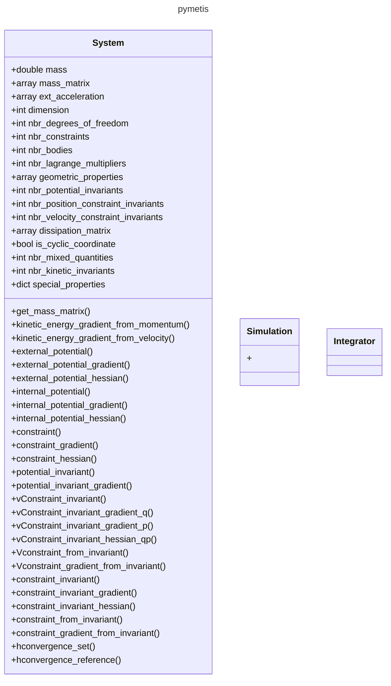

# Install Python package `pymetis` in editable-/develoment-mode

```bash
pip install --editable .
```

# Structure


```mermaid
---
title: pymetis
---
classDiagram
    class System{
        +double mass
        +array mass_matrix
        +array ext_acceleration
        +int dimension
        +int nbr_degrees_of_freedom
        +int nbr_constraints
        +int nbr_bodies
        +int nbr_lagrange_multipliers
        +array geometric_properties
        +int nbr_potential_invariants
        +int nbr_position_constraint_invariants
        +int nbr_velocity_constraint_invariants
        +array dissipation_matrix
        +bool is_cyclic_coordinate
        +int nbr_mixed_quantities
        +int nbr_kinetic_invariants
        +dict special_properties
        +get_mass_matrix()
        +kinetic_energy_gradient_from_momentum()
        +kinetic_energy_gradient_from_velocity()
        +external_potential()
        +external_potential_gradient()
        +external_potential_hessian()
        +internal_potential()
        +internal_potential_gradient()
        +internal_potential_hessian()
        +constraint()
        +constraint_gradient()
        +constraint_hessian()
        +potential_invariant()
        +potential_invariant_gradient()
        +vConstraint_invariant()
        +vConstraint_invariant_gradient_q()
        +vConstraint_invariant_gradient_p()
        +vConstraint_invariant_hessian_qp()
        +Vconstraint_from_invariant()
        +Vconstraint_gradient_from_invariant()
        +constraint_invariant()
        +constraint_invariant_gradient()
        +constraint_invariant_hessian()
        +constraint_from_invariant()
        +constraint_gradient_from_invariant()
        +hconvergence_set()
        +hconvergence_reference()
    }
    class Simulation{
        +
    }
    class Integrator{
    }
```
