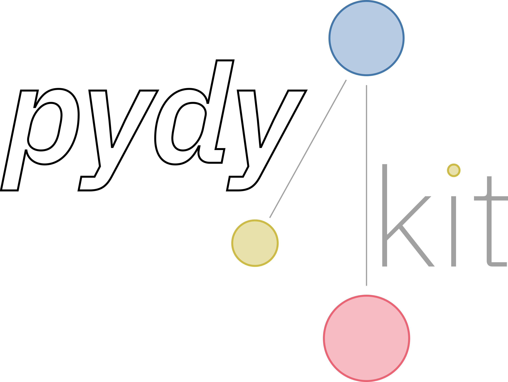

<p align="center">
  <a href="https://github.com/pydykit/pydykit"></a>
</p>

[](https://github.com/pydykit/pydykit/actions/workflows/pytest.yml)
[](https://github.com/psf/black)
[](LICENSE)

# `pydykit`: A *Py*thon-based *dy*namics simulation tool*kit*

`pydykit` provides a basic framework for the simulation of dynamical systems.
The package is based on time stepping methods,
which are discrete versions of the corresponding dynamics equations - either ordinary differential equations (ODEs) or differential-algebraic equations (DAEs).

## How to start

1. Starting on a new machine, create a new virtual environment and activate it. We recommend using `venv`:

   ```bash
   python3.12 -m venv .venv
   source .venv/bin/activate
   ```

2. Install the local python package `pydykit` in editable-/develoment-mode:

   ```bash
   pip install --editable .
   ```

3. Run your first script, e.g.

   ```bash
   python scripts/s*.py
   ```

## Running tests against installed code

See [test/README.md](./test/README.md)
