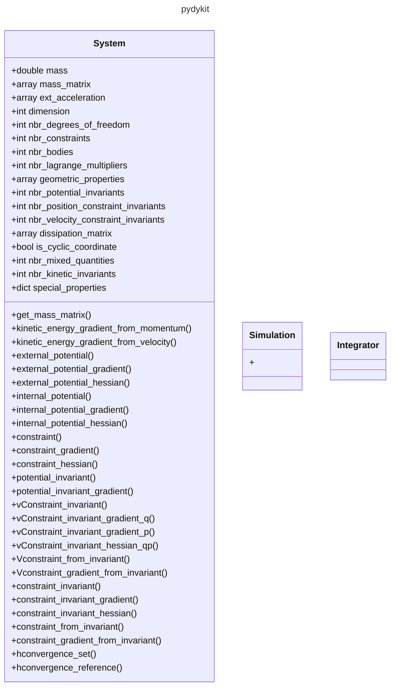

# Visualize the Code Structure

Following this [stackoverflow contribution](https://stackoverflow.com/a/7554457/8935243)
we can use
[`pyreverse`](https://pylint.readthedocs.io/en/stable/pyreverse.html)
which ships with `pylint`. Additionally we will need `graphviz` to create png-files.

```bash
conda install pylint graphviz
```

to visualize our package `pydykit`.
Therefore, we navigate into the package

```bash
cd pydykit
```

and execute

```bash
pyreverse -p pydykit .
```

to generate a graphviz-dot-file which represents the structure of both the package and it's classes.

A dot-file can be used to generate a visualization (I did not yet succeed in finding a way to create mermaid-code from a graphviz-dot-file).
Example:

```bash
pyreverse -o png -p pydykit .
```


A subset of a package, composed out of selected modules can be visualized by, e.g.,

```bash
pyreverse -o png -p MySubset integrators.py managers.py simulators.py solvers.py systems_dae.py systems_multi_body.py systems_port_hamiltonian.py systems.py
```

# Structure


